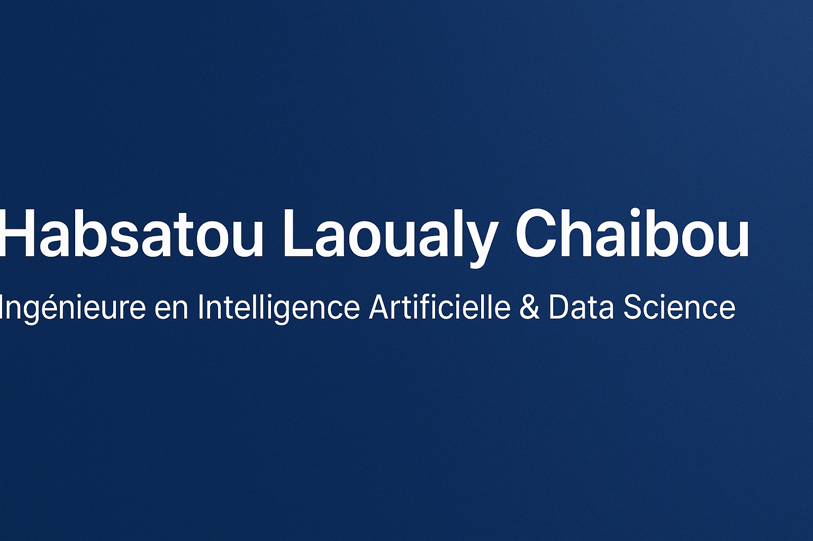

  

# 👋 Bonjour, je suis Habsatou Laoualy Chaibou  

🎓 Diplômée en **Ingénierie Mathématique et Data Science** à l’Université de Haute-Alsace (France)  
🤖 Spécialisée en **intelligence artificielle**, **vision par ordinateur** et **apprentissage profond**  
💡 J’aime transformer des données brutes en modèles explicables et utiles à la recherche ou à l’industrie.  

---

## 🚀 Domaines de compétence  

**Langages & Outils**  

**Machine Learning & Deep Learning**  

**Outils & Environnements**  

---

## 💼 Projets récents

### 🧠 Prédiction des paramètres électriques des transistors HBT  
**STMicroelectronics, Crolles (France)** — *Septembre à Décembre 2024*  
- Prétraitement et optimisation des données : nettoyage, détection d’outliers et structuration  
- Développement et entraînement d’un **modèle prédictif Random Forest**, testé parmi plusieurs modèles  
- Meilleure performance : **80 % de précision** pour l’estimation des paramètres électriques  
- Collaboration avec les experts métiers pour valider la robustesse du modèle  

---

### 🕵️‍♀️ Étude des méthodes de détection d’objets  
**Projet de recherche en vision par ordinateur** — *Septembre à Décembre 2024*  
- Comparaison des approches **YOLO, SSD et R-CNN**  
- Implémentation de **YOLOv8** pour la détection sur des images locales et la base **COCO**  
- Analyse qualitative et quantitative des résultats  

---

###  Segmentation d’images médicales par apprentissage auto-supervisé  
**Projet académique / recherche** — *Octobre 2024 à Janvier 2025*  
- Développement d’un modèle **ResUNet** pour segmenter des images CT du foie  
- Intégration de la structure **Max-Tree** et de l’**apprentissage auto-supervisé**  
- Amélioration de la précision de segmentation grâce à des représentations hiérarchiques  

---

## En ce moment
- Je poursuis la création d’un projet de bout en bout, allant de l’ingestion et la préparation des données jusqu’à la mise en production d’un modèle d’intelligence artificielle. Ce projet me permet d’approfondir mes compétences en data engineering, modélisation, et déploiement de solutions IA.*  
- 💼 Ouverte aux **opportunités professionnelles** en IA, data science et deep learning   

---

## 📫 Me contacter  
💼 [LinkedIn](https://www.linkedin.com/in/habsatou-laoualy-chaibou)  
 

---

